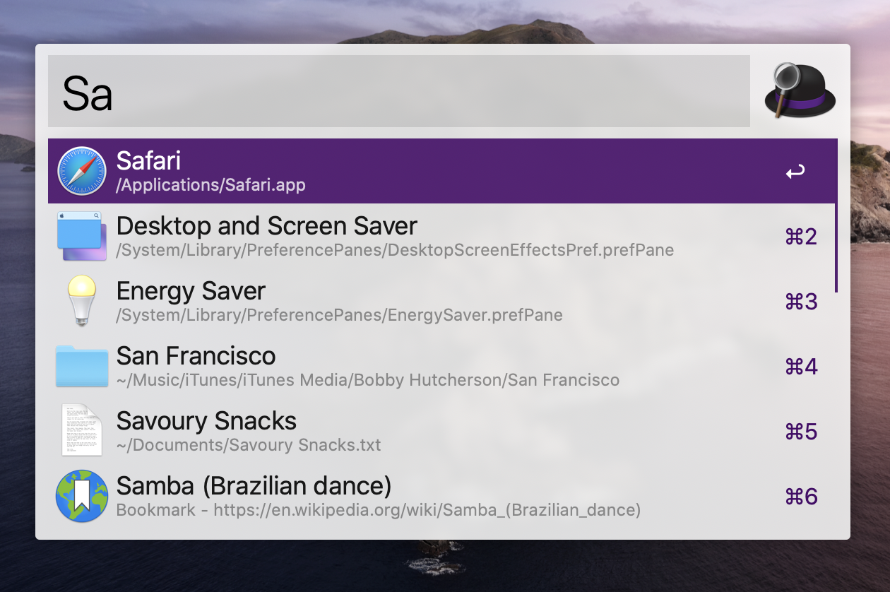

# Alfred

[Alfred](https://www.alfredapp.com) is my favorite productivity utility for Mac. It functions as an application launcher, file search, snippet handler, and automation tool.

## Setup

I've set Alfred to use the **⌘-Space** hotkey. This opens the Alfred popup window.

### Configuration

I've set Alfred to keep its configuration on a folder synced between computers with ResilioSync (_Preferences → Advanced → Syncing → Set preferences folder_)  – this way my configuration is automatically synced between computers.

## Workflows

- [Gitmoji](https://github.com/Quilljou/alfred-gitmoji-workflow) – Search and copy gitmoji to clipboard
