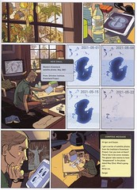

## Global Storytelling

Nov 5, 2008. Originally published on [jeffvandermeer.com](https://www.jeffvandermeer.com/2008/11/05/global-storytelling/)

Risto Isomäki is a Finnish science journalist, environmental activist, and science fiction writer. He’s published several novels and short stories and been nominated for the Finlandia award (the biggest and most prestigious Finnish literary award) for his sf ecothriller Sarasvatin hiekkaa.

The reason I’m talking about this is because the book has recently been adapted as a graphic novel, and it’s also been published in English with the title _The Sands of Sarasvati_.

The story is set in the 2020s. A Russian scientist is invited to India because he’s invented a special submarine that might be suitable for researching the odd discoveries made near the Indian coast. There are traces there of ancient civilizations previously unknown to scientists, and as big a mystery as their discovery seems to be the way they’ve suddenly been destroyed. Meanwhile a Finnish eco-activist is developing potential means for stopping the polar ice caps from melting. And in Greenland, local research team makes some very strange and disturbing discoveries.

The story deals with the effects of global climate change, a subject Isomäki has been interested in since the early 1980s, and still is—his latest book is a non-fiction book called _34 tapaa estää maapallon ylikuumeneminen_ (“34 ways to stop the Earth from over-heating”). _The Sands of Sarasvati_ speculates on possible consequences sudden changes in the climate might have for our planet and their fascinating similarities with some hypothetical ancient civilizations (as imagined from both old myths and current real-world research).

Isomäki is in many aspects—good and bad—a typical hard sf writer. His books tend to have a big (actually, huge) idea, around which the story centers. He backs up his speculation with an impressive amount of facts (unfortunately many of those make it to the pages of the books as serious infodumping). The world and the speculation—and often the message he’s conveying—are the main point of the books, and while they create real sense of wonder, at the same time his plot is often very straightforward, and the characters are there to serve the story and are often left rather thin. Isomäki is clearly at his best when he’s describing his big ideas, but his dialogue can be awkward, especially when describing the relationships between his characters.

These weaknesses in Isomäki’s prose may be why _The Sands of Sarasvati_ works so damn well as a graphic novel. Writer Petri Tolppanen and artist Jussi Kaakinen have done a magnificient job in creating the comic version of the novel. In the process, the plot has been shortened a bit, but the text and pictures together flesh out the story and characters better than Isomäki’s words. The creators trust the medium in telling the story—there’s not an explanatory text box in sight. Kaakinen’s pictures are beautiful, and I really like the way the story flows effortlessly on the page. A couple of key scenes could perhaps have used bolder, bigger images, but otherwise everything works really well, and the story brings the disparate elements together beautifully towards the end.

Isomäki’s story doesn’t shy away from making changes in his world, and there are no easy cures for big problems here. This definitely isn’t a story where a brave action hero single-handedly saves the world, and sometimes you can come across a problem that’s impossible to solve or a disaster that just can’t be prevented. There is, however, a message of hope in Isomäki’s writing. Even though the current situation may be grim, he thinks that mankind can survive with cooperation, scientific research, and also the aid of technology (here he refreshingly sets himself apart from so many eco-activists who distrust all technology—even when using the Internet to spread their word—and are endlessly cynical and pessimistic about the nature of the human race).

_The Sands of Sarasvati_ is a great graphic novel, and I would recommend it to everybody who’s interested in the current climate change discussion, or just in reading an excellent example of quality comic storytelling. Unfortunately I don’t think it’s at the moment easily available outside of Finland (the Finnish publisher is shopping around for a publisher in the UK or USA, though). In Finland, at least the online book store BookPlus1 "The Sands of Sarasvati at BookPlus") sells the graphic novel also to abroad (and accepts credit cards), but the postage on a single purchase can be very steep, I’m afraid. But if you somehow manage to get your hands on this book, grab it and read it.

You can see the images in this post in higher resolution in [a blog post](https://chawedrosin.wordpress.com/2008/09/30/the-sands-of-sarasvati/ "The Sands of Sarasvati -- the Chawed Rosin") by the translator of the English edition.

The Sands of Sarasvati is published by [Tammi Kustannusosakeyhtiö](http://www.tammi.fi/). ISBN: 9789513144906.

1 Broken link removed
